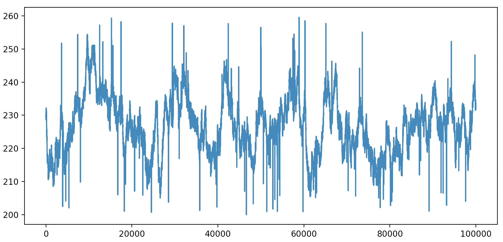
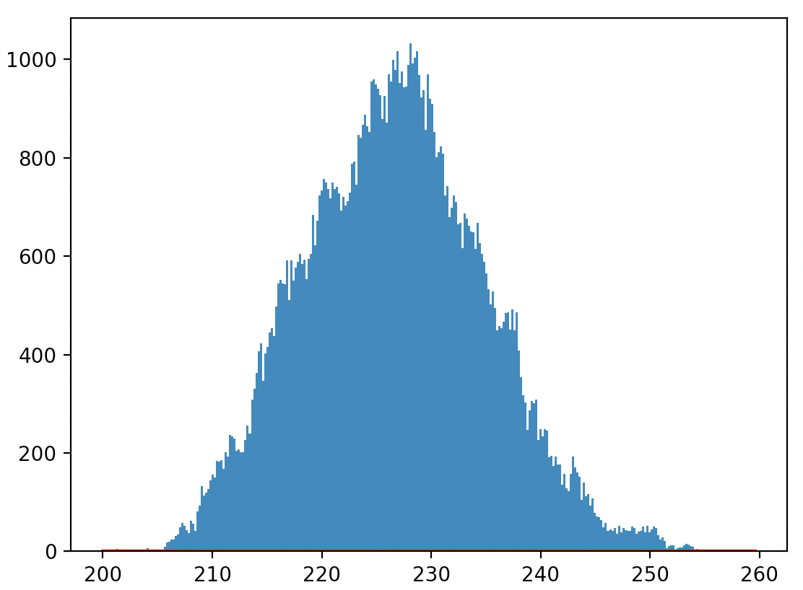

# Data Generator

The Data Generator evolved as a standalone tool which can be used independently of the holistic comparison use case. This file describes how the Data Generator can be adapted and the functionality as well as explain different example use cases.

## Table of Contents

- [Data Generator](#data-generator)
  * [General Information](#general-information)
    + [About](#about)
    + [How To](#how-to)
    + [Supported Databases](#supported-databases)
      - [CrateDB](#cratedb)
      - [InfluxDB](#influxdb)
      - [TimescaleDB](#timescaledb)
      - [MongoDB](#mongodb)
      - [PostgreSQL](#postgresql)
      - [AWS Timestream](#aws-timestream)
      - [Microsoft SQL Server](#mircosoft-sql-server)
  * [Data Generator Configuration](#data-generator-configuration)
    + [Environment variables configuring the behaviour of the Data Generator](#environment-variables-configuring-the-behaviour-of-the-data-generator)
      - [NUM_THREADS](#num_threads)
      - [ID_START](#id_start)
      - [ID_END](#id_end)
      - [INGEST_MODE](#ingest_mode)
        * [INGEST_MODE 0](#ingest_mode-0)
        * [INGEST_MODE 1](#ingest_mode-1)
      - [INGEST_SIZE](#ingest_size)
      - [INGEST_TS](#ingest_ts)
      - [INGEST_DELTA](#ingest_delta)
      - [MODEL_PATH](#model_path)
      - [BATCH_SIZE](#batch_size)
      - [DATABASE](#database)
      - [STAT_DELTA](#stat_delta)
    + [Environment variables used to configure different databases](#environment-variables-used-to-configure-different-databases)
      - [HOST](#host)
      - [USERNAME](#username)
      - [PASSWORD](#password)
      - [DB_NAME](#db_name)
      - [TABLE_NAME](#table_name)
      - [PARTITION](#partition)
    + [Environment variables used to configure CrateDB](#environment-variables-used-to-configure-cratedb)
      - [SHARDS](#shards)
      - [REPLICAS](#replicas)
    + [Environment variables used to configure TimescaleDB](#environment-variables-used-to-configure-timescaledb)
      - [PORT](#port)
      - [TIMESCALE_COPY](#timescale_copy)
      - [TIMESCALE_DISTRIBUTED](#timescale_distributed)
    + [Environment variables used to configure InfluxDB](#environment-variables-used-to-configure-influxdb)
      - [TOKEN](#token)
      - [ORG](#org)
    + [Environment variables used to configure AWS Timestream](#environment-variables-used-to-configure-aws-timestream)
      - [AWS_ACCESS_KEY_ID](#aws_access_key_id)
      - [AWS_SECRET_ACCESS_KEY](#aws_secret_access_key)
      - [AWS_REGION_NAME](#aws_region_name)
  * [Data Generator Models](#data-generator-models)
    + [Structure](#structure)
    + [Complex Model Example](#complex-model-example)
    + [Sensor Types](#sensor-types)
      - [Float Sensor](#float-sensor)
      - [Bool Sensor](#bool-sensor)
  * [Batch-Size-Automator](#batch-size-automator)
    + [Setup](#setup)
    + [Modes](#modes)
      - [Finding best batch size](#finding-best-batch-size)
      - [Surveillance mode](#surveillance-mode)
  * [Prometheus Metrics](#prometheus-metrics)
  * [Example Use Cases](#example-use-cases)
    + [Single Type of Edge](#single-type-of-edge)
    + [Multiple Types of Edges](#multiple-types-of-edges)
  * [Alternative data generators](#alternative-data-generators)
    + [Why use this data generator over the alternatives?](#why-use-this-data-generator-over-the-alternatives)
    + [cr8 + mkjson](#cr8--mkjson)
    + [tsbs data generator](#tsbs-data-generator)
  * [Glossary](#glossary)

## General Information

This chapter covers general information about the Data Generator, e.g. the supported databases and the basic workflow.

### About

The Data Generator is a tool to generate timeseries data which adheres to a [statistical model](#data-generator-models) both for [populating a database](#ingest_mode) as well as having a way to [continuously insert](#ingest_mode) timeseries data.

### How To

The easiest way to use the Data Generator is to build the Docker Image:

+ navigate to root directory of this repository
+ build docker image with `docker build -t data_gen -f Dockerfile .`
+ Adapt one of the example docker-compose files in the [example folder](src/data_generator/examples)
+ start (e.g. crate example) with `docker-compose -f src/data_generator/examples/docker-compose_crate.yml up`

For an explanation on how to set the environment variables see [Environment variables](#data-generator-configuration).
For example use cases see [Example use cases](#example-use-cases)

### Supported Databases

Currently 5 Databases are
+ [CrateDB](https://crate.io/)
+ [InfluxDB V2](https://www.influxdata.com/)
+ [TimescaleDB](https://www.timescale.com/)
+ [MongoDB](https://www.mongodb.com/)
+ [PostgreSQL](https://www.postgresql.org/)
+ [AWS Timestream](https://aws.amazon.com/timestream/)
+ [Microsoft SQL Server](https://www.microsoft.com/de-de/sql-server)

Databases can be run either local or in the Cloud as both use cases are supported. Support for additional databases depends on the demand for it.

The following chapters give an overview over the specific implementation for the different databases.

#### CrateDB

##### Client Library

For CrateDB the [crate](https://pypi.org/project/crate/) library is used. To connect to CrateDB the following environment variables must be set:

+ [HOST](#host): hostname including port e.g. `localhost:4200`
+ [USERNAME](#username): CrateDB username.
+ [PASSWORD](#password): password for CrateDB user.

##### Table Setup

A table gets it's name either from the provided [model](#data-generator-models) or from the environment variable [table_name](#table_name)

A table for CrateDB has three columns:

+ `ts`: column containing a timestamp (occurrence of the payload)
+ `g_ts_'interval'`: column containing the `ts` value truncated to the value set with [PARTITION](#partition). It is used to partition the table and generated by the DB.
+ `payload`: column containing the the values, is of type [OBJECT](https://crate.io/docs/crate/reference/en/latest/general/ddl/data-types.html#object) Dynamic. The concrete subcolumns are definied by the provided [model](#data-generator-models).

Additional table configuration:

+ with [SHARDS](#shards) the amount of shards for the table can be configured
+ with [REPLICAS](#replicas) the amount of replicas for the table can be configured

##### Insert

Insert is done using the [unnest](https://crate.io/docs/crate/reference/en/latest/general/builtins/table-functions.html?#unnest-array-array) function of CrateDB.

##### Specifics

+ All columns and sub-columns are automatically indexed
+ Using an object column makes it possible to insert the values for multiple models into a single table (similar to a schema-less approach of a NO-SQL database).
+ Using `unnest` for the insert makes it possible to take the generated values without modification and insert them directly into the table.

#### InfluxDB

##### Client Library

For InfluxDB the [influx-client](https://pypi.org/project/influxdb-client/) library is used as the Data Generator only supports InfluxDB V2. To connect to InfluxDB the following environment variables must be set:

+ [HOST](#host): hostname
+ [TOKEN](#token): InfluxDB Read/Write token
+ [ORG](#org): InfluxDB organization

##### Bucket Setup

A bucket gets it's name either from the provided [model](#data-generator-models) or from the environment variable [table_name](#table_name)

If a bucket with the same name already exists on the given host this bucket is used to insert data otherwise a new bucket is created without retention rules (data is saved indefinitely)

##### Insert

Insert into InfluxDB is done using the `Point` type from the `influxdb_client.client.write.api`. All tags from the [model](#data-generator-models) are added to `Point.tag` (InfluxDB creates indices for tags). Metrics are saved to `Point.field`. The timestamp is added to `Point.time`. Multiple Points are then inserted in a batch.

##### Specifics

+ All tags are automatically indexed
+ Insert of multiple models into a single bucket is possible due to InfluxDB being a NoSQL database.
+ When using InfluxDB V2 with a usage-based plan insert is limited to 300MB/5m, this is about 15.000 metrics per second, additional metrics are dropped by InfluxDB and the client is not informed.

#### TimescaleDB

##### Client Library

For TimescaleDB the [psycopg2](https://pypi.org/project/psycopg2/) library is used. As psycopg2 does not have the best insert performance for TimescaleDB (see [here](https://docs.timescale.com/latest/tutorials/quickstart-python#insert_rows)) to insert a lot of metrics it is advised to split [IDs](#id_start) over multiple data-generator instances.

Note: starting with version `0.1.3` TimescaleDB uses the [pgcopy](https://pypi.org/project/pgcopy/) library by default to enhance insert performance for single clients. To override the default setting you can set [TIMESCALE_COPY](#timescale_copy) to `False`.

To connect with TimescaleDB the following environment variables must be set:

+ [HOST](#host): hostname
+ [PORT](#port): port
+ [USERNAME](#username): username of TimescaleDB user
+ [PASSWORD](#password): password of TimescaleDB user
+ [DB_NAME](#db_name): the database name with which to connect

##### Table Setup

A table gets it's name either from the provided [model](#data-generator-models) or from the environment variable [table_name](#table_name)

A table for TimescaleDB consists of the following columns:

+ `ts`: column containing a timestamp (occurrence of the payload)
+ `ts_'interval'`: column containing the `ts` value truncated to the value set with [PARTITION](#partition).
+ a column for each entry in `tags` and `metrics`.
    + `tags` are of type `INTEGER` when using numbers and of type `TEXT` when using list notation
    + `metrics` are of the type defined in the [model](#data-generator-models)

**If a table with the same name already exists which doesn't have the expected structure the data-generator will fail when inserting values.**

Using this table a TimescaleDB Hypertable is created partitioned by the `ts` and `ts_'interval'` column

##### Insert

Insert is done in batches.

##### Specifics

+ No index is created, to query data indices must be created manually.
+ Insert of multiple models into a single table is not possible as the table schema is only created once.
+ psycopg2 does not have the best insert performance for TimescaleDB (see [here](https://docs.timescale.com/latest/tutorials/quickstart-python#insert_rows)) to insert a lot of metrics it is advised to split [IDs](#id_start) over multiple data-generator instances.
+ TimescaleDB can be used with distributed hypertables, to test the data_generator with these the [TIMESCALE_DISTRIBUTED] environment variable must be set to `True`.

#### MongoDB

##### Client Library

For MongoDB the [MongoClient](https://mongodb.github.io/node-mongodb-native/api-generated/mongoclient.html) library is used.

To connect with MongoDB the following environment variables must be set:

+ [HOST](#host): hostname (can include port if not standard MongoDB port is used)
+ [USERNAME](#username): username of TimescaleDB user
+ [PASSWORD](#password): password of TimescaleDB user
+ [DB_NAME](#db_name): The name of the MongoDB database that will be used

##### Collection Setup

A collection gets it's name from the provided [model](#data-generator-models).

A document in the collection consists of the following elements:

+ `measurement`: same as the collection name
+ `date`: the timestamp of the measurement in datetime format
+ `tags`: tags that were defined in the [model](#data-generator-models)
+ `metrics`: metrics that were defined in the [model](#data-generator-models)

##### Insert

Insert is done using the `insert_many` function of the collection to insert documents in batches.

##### Specifics

+ MongoDB only creates a default index other indices have to be created manually.
+ Insert of multiple models into a single collection is possible but it's advised to use different collections for each model (same database is fine).

#### PostgreSQL

##### Client Library

For PostgreSQL the [psycopg2](https://pypi.org/project/psycopg2/) library is used.

To connect with PostgreSQL the following environment variables must be set:

+ [HOST](#host): hostname
+ [PORT](#port): port
+ [USERNAME](#username): username of TimescaleDB user
+ [PASSWORD](#password): password of TimescaleDB user
+ [DB_NAME](#db_name): the database name with which to connect

##### Table Setup

A table gets it's name either from the provided [model](#data-generator-models) or from the environment variable [table_name](#table_name)

A table for PostgreSQL consists of the following columns:

+ `ts`: column containing a timestamp (occurrence of the payload)
+ `ts_'interval'`: column containing the `ts` value truncated to the value set with [PARTITION](#partition).
+ a column for each entry in `tags` and `metrics`.
    + `tags` are of type `INTEGER` when using numbers and of type `TEXT` when using list notation
    + `metrics` are of the type defined in the [model](#data-generator-models)

**If a table with the same name already exists which doesn't have the expected structure the data-generator will fail when inserting values.**

##### Insert

Insert is done in batches.

##### Specifics

+ No index is created, to query data indices must be created manually.
+ Insert of multiple models into a single table is not possible as the table schema is only created once.

#### AWS Timestream

##### Client Library

For AWS Timestream the [boto3](https://github.com/boto/boto3) library is used.

To connect with AWS Timestream the following environment variables must be set:

+ [AWS_ACCESS_KEY_ID](#aws_access_key_id): AWS Access Key ID
+ [AWS_SECRET_ACCESS_KEY](#aws_secret_access_key): AWS Secret Access Key
+ [AWS_REGION_NAME](#aws_region_name): AWS Region
+ [DB_NAME](#db_name): the database name to connect to or create

##### Table Setup

A table gets it's name from the provided [model](#data-generator-models)

A table for AWS Timestream consists of the following columns:

+ A column for each `tag` in the provided model
+ All columns necessary for the AWS Timestream [datamodel](https://docs.aws.amazon.com/timestream/latest/developerguide/getting-started.python.code-samples.write-data.html):

**If a table or database with the same name already exists it will be used by the data generator**

##### Insert

The insert is done according to the optimized write [documentation](https://docs.aws.amazon.com/timestream/latest/developerguide/getting-started.python.code-samples.write-data-optimized.html). Values are grouped by their tags and inserted in batches. As AWS Timestream has a default limit of 100 values per batch, the batch is limited to have a maximum size of 100.

##### Specifics

+ Tests show that about 600 values per second can be inserted by a single data generator instance. So the data model has to be adjusted accordingly to not be slower than the settings require.
  + e.g. having 600 sensors with each 2 metrics and each should write a single value each second would require 1200 values/s of insert speed. For this at least 2 data generator instance would be needed.
  
#### Mircosoft SQL Server

##### Client Library

For Microsoft SQL Server the [pyodcb](https://github.com/mkleehammer/pyodbc) library is used.

To connect with Microsoft SQL Server the following environment variables must be set:

+ [HOST](#host): the host where Microsoft SQL Server is running in this [format](https://www.connectionstrings.com/azure-sql-database/)
+ [USERNAME](#username): Database user
+ [PASSWORD](#password): Password of the database user
+ [DB_NAME](#db_name): the database name to connect to or create

##### Table Setup

A table gets it's name from the provided [model](#data-generator-models)

A table for Microsoft SQL Server consists of the following columns:

+ `ts`: column containing a timestamp (occurrence of the payload)
+ a column for each entry in `tags` and `metrics`.
    + `tags` are of type `INTEGER` when using numbers and of type `TEXT` when using list notation
    + `metrics` are of the type defined in the [model](#data-generator-models)

**If a table or database with the same name already exists it will be used by the data generator**

##### Insert

The insert is done using the `executemany` function

## Data Generator Configuration

The Data Generator is mostly configured by setting Environment Variables. This chapter lists all available Environment Variables and explains their use in the Data Generator.

### Environment variables configuring the behaviour of the Data Generator

The environment variables in this chapter are used to configure the behaviour of the data generator

#### NUM_THREADS

Type: Integer

Value: A positive number.

Default: 1

The Data Generator will split the insert into as many threads as this variable indicates. It will use `threading.Threads`
as 

#### ID_START

Type: Integer

Value: A positive number. Must be smaller than [ID_END](#id_end).

Default: 1

The Data Generator will create `(ID_END + 1) - ID_START` edges.

#### ID_END

Type: Integer

Value: A positive number. Must be greater than [ID_START](#id_start).

Default: 500

The Data Generator will create `(ID_END + 1) - ID_START` edges.

#### INGEST_MODE

Type: Integer

Values: 0 or 1

Default: 1

##### INGEST_MODE 0

When `INGEST_MODE` is set to `0` the Data Generator goes into "steady load"-mode. This means for all edges controlled by the Data Generator an insert is performed each [INGEST_DELTA](#ingest_delta) seconds.

**Note: If too many edges are controlled by one Data Generator instance so an insert cannot be performed in the timeframe set by INGEST_DELTA it is advised to split half the IDs to a separate Data Generator instance: e.g. one instance uses `ID_START=1, ID_END=500` and the other `ID_START=501, ID_END=1000`**

With this configuration the [Batch Size Automator](#batch-size-automator) is disabled. Therefor the [Prometheus metrics](#prometheus-metrics) g_insert_time, g_rows_per_second, g_best_batch_size, g_best_batch_rps, will stay at 0.

##### INGEST_MODE 1

When `INGEST_MODE` is set to `1` the Data Generator goes into "burst insert"-mode. This means it tries to insert as many values as possible. This mode is used populate a database and can be used to measure insert performance.

Using this mode results in values inserted into the database at a faster rate than defined by [INGEST_DELTA](#ingest_delta) but the timestamp values will still adhere to this value and be in the defined time interval. This means that if [INGEST_TS](#ingest_ts) is not set to a specific value timestamps will point to the future. By adjusting INGEST_TS to a timestamp in the past in combination with a limited [INGEST_SIZE](#ingest_size) the rang of timestamps can be controlled.

When [BATCH_SIZE](#batch_size) is set to a value smaller or equal to 0 the [Batch Size Automator](#batch-size-automator) is activated. This means that the insert performance is supervised and the batch size adjusted to have a fast insert speed. If the value is greater than 0 the batch size will be fixed at this value and the Batch Size Automator will be disabled.

#### INGEST_SIZE

Type: Integer

Values: A positive number

Default: 1000

`INGEST_SIZE` defines how many values for each edge will be created. When setting `INGEST_SIZE` to `0` an endless amount of values is created until the Data Generator is terminated.

Example:

+ ID_START: 1
+ ID_END: 500
+ INGEST_SIZE: 2000

We have 500 edges and for each edge 2000 values are generated, therefore we will have 1.000.000 values in total.

**Note: a value contains all the information for a single edge, including the defined `tags` and `metrics`. See [Data Generator Models](#data-generator-models) for more information about tags and metrics.**

#### INGEST_TS

Type: Integer

Values: A valid UNIX timestamp

Default: timestamp at the time the Data Generator was started

This variable defines the first timestamp used for the generated values. When using [INGEST_MODE 1](#ingest_mode-1) all following timestamps have an interval to the previous timestamp by the value of [INGEST_DELTA](#ingest_delta). When using [INGEST_MODE 0](#ingest_mode-0) the second insert happens when `INGEST_TS + INGEST_DELTA` is equal or bigger than the current timestamp (real life). This means that if INGEST_TS is set to the future no inserts will happen until the `INGEST_TS + INGEST_DELTA` timestamp is reached.

#### INGEST_DELTA

Type: Float

Values: Any positive number

Default: 0.5

The value of `INGEST_DELTA` defines the interval between timestamps of the generated values.

#### MODEL_PATH

Type: String

Values: Either relative or absolute path to a model in the json format (see [Data Generator Models](#data-generator-models) for more information on models).

Default: empty string

When using a relative path with the docker image be sure to checkout the [Dockerfile](Dockerfile) to be sure to use the correct path.

#### BATCH_SIZE

Type: Integer

Values: Any number.

Default: -1

`BATCH_SIZE` is only taken into account when [INGEST MODE](#ingest_mode) is set to `1`. The value of `BATCH_SIZE` defines how many rows will be inserted with one insert statement. If the value is smaller or equal to `0` the [Batch Size Automator](#batch-size-automator) will take control over the batch size and dynamically adjusts the batch size to get the best insert performance.

#### DATABASE

Type: Integer

Values: 0..4

Default: 0

The value will define which database is used:
+ 0: CrateDB
+ 1: TimescaleDB
+ 2: InfluxDB
+ 3: MongoDB
+ 4: PostgreSQL

#### STAT_DELTA

Type: Integer

Values: A positive number

Default: 30

Prints statistics of average function execution time every `STAT_DELTA` seconds.

### Environment variables used to configure different databases

The environment variables in this chapter are used by different databases to connect and configure them. Each entry will contain the databases for which they are used and example values. For collected information for a single database see the chapters for the database:
+ [CrateDB](#cratedb)
+ [InfluxDB](#influxdb)
+ [TimescaleDB](#timescaledb)
+ [MongoDB](#mongodb)
+ [AWS Timestream](#aws-timestream)

#### HOST

Type: String

Values: hostname according to database client requirements

Default: localhost

used with CrateDB, TimescaleDB, MongoDB.

**CrateDB:**

host must include port, e.g.: `"localhost:4200"`

**TimescaleDB:**

host must be hostname excluding port, e.g.: `"localhost"`

**MongoDB:**

host can be either without port (e.g. `"localhost"`) or with port (e.g. `"localhost:27017"`)

#### USERNAME

Type: String

Values: username of user used for authentication against the database

Default: None

used with CrateDB, TimescaleDB, MongoDB.

#### PASSWORD

Type: String

Values: password of user used for authentication against the database

Default: None

used with CrateDB, TimescaleDB, MongoDB.

#### DB_NAME

Type: String

Values: Name of the database where table will be created

Default: empty string

used with InfluxDB, TimescaleDB, MongoDB, AWS Timestream.

**InfluxDB:**
This is an optional parameter for InfluxDB. In case it is set the Bucket where the values are inserted will use the value of `DB_NAME` as name. If `DB_NAME` is empty string than the name of the model (see [Data Generator models](#data-generator-models) for more information) will be used as Bucket name.

**TimescaleDB:**
The value of `DB_NAME` is used when connecting to TimescaleDB. This database must already exist in your TimescaleDB instance and must have already been initialized with `CREATE EXTENSION IF NOT EXISTS timescaledb CASCADE;`.

**MongoDB:**
The value of `DB_NAME` is used as the database parameter of MongoDB.

**AWS Timestream:**
The value of `DB_NAME` is used as the database parameter of AWS Timestream.

#### TABLE_NAME

Type: String

Values: Name of the table where values are stored

Default: empty string

used with CrateDB and TimescaleDB. It is an optional parameter to overwrite the default table_name defined in the model (see [Data Generator models](#data-generator-models)).

#### PARTITION

Type: String

Values: second, minute, hour, day, week, month, quarter, year

Default: week

used with CrateDB and TimescaleDB. Is used to define an additional Column to partition the table. E.g. when using `week` an additional column is created (Crate: `g_ts_week`, Timescale `ts_week`) and the value from the `ts` column is truncated to its week value.

### Environment variables used to configure CrateDB

The environment variables in this chapter are only used to configure CrateDB

#### SHARDS

Type: Integer

Values: positive number

Default: 4

Defines how many [shards](https://crate.io/docs/crate/reference/en/latest/general/ddl/sharding.html) will be used.

#### REPLICAS

Type: Integer

Values: positive number

Default: 0

Defines how many [replicas](https://crate.io/docs/crate/reference/en/latest/general/ddl/replication.html) for the table will be created.

### Environment variables used to configure TimescaleDB

The environment variables in this chapter are only used to configure TimescaleDB

#### PORT

Type: Integer

Values: positive number

Default: 5432

Defines the port number of the host where TimescaleDB is reachable.

#### TIMESCALE_COPY

Type: Boolean

Values: True or False

Default: True

Defines if Timescale insert uses `pgcopy` or not.

#### TIMESCALE_DISTRIBUTED

Type: Boolean

Values: True or False

Default: False

Defines if Timescale is used with distributed hypertables or not.

### Environment variables used to configure InfluxDB

The environment variables in this chapter are only used to configure InfluxDB

#### TOKEN

Type: String

Values: token gotten from InfluxDB V2

Default: empty string

Influx V2 uses [token](https://v2.docs.influxdata.com/v2.0/security/tokens/view-tokens/) based authentication.

#### ORG

Type: String

Values: org_id gotten from InfluxDB V2

Default: empty string

Influx V2 uses [organizations](https://v2.docs.influxdata.com/v2.0/organizations/) to manage buckets.

### Environment variables used to configure AWS Timestream

The environment variables in this chapter are only used to configure AWS Timestream

#### AWS_ACCESS_KEY_ID

Type: String

Values: AWS Access Key ID

Default: empty string

#### AWS_SECRET_ACCESS_KEY

Type: String

Values: AWS Secret Access Key

Default: empty string

#### AWS_REGION_NAME

Type: String

Values: AWS region name

Default: empty string

## Data Generator Models

The Data Generator uses models to determine what kind of values to generate. These models are described in JSON-files. This chapter explains how to write models based on examples.

### Structure

A Data Generator Model is a JSON-file which must contain one object (a second key `description` can be used to explain the model). The key for this object will be the default value of [TABLE_NAME](#table_name). For example the following JSON Object would contain a model called `button_sensor`.

```JSON
{
    "button_sensor": {"..."}
}
```

This top-level object must have two sub-level objects `tags` and `metrics`. `tags` are all values that identify the thing where the measured values come from. `metrics` are all measured values of a thing. For example we use our `button_sensor` model. A sensor is identified by a `sensor_id` (we keep it simple for the first example). And has a single metric `button_press`:

```JSON
{
    "button_sensor": {
        "tags": {
            "sensor_id": "id"
        },
        "metrics": {
            "button_press": {"..."}
        }
    }
}
```

As you can see the `sensor_id` tag gets the value `"id"` this means it will be the bottom-level tag directly associated with the values between `ID_START` and `ID_END`.
The `button_sensor` metric is another object describing how the value of this object should be calculated and saved to the database.

```JSON
{
    "button_sensor": {
        "tags": {
            "sensor_id": "id"
        },
        "metrics": {
            "button_press": {
                "key": {
                    "value": "button_pressed"
                },
                "type": {
                    "value": "BOOL"
                },
                "true_ratio": {
                    "value": 0.001
                }
            }
        }
    }
}
```

The `button_press` metric is of type `BOOL` and has a true_ratio of `0.001` which means it is true in 1 out of 1000 cases. Go to [Sensor Types](#sensor-types) to get a more detailed overview over the different Sensor types. Or look at [motor.json](src/data_generator/examples/motor.json) or [temperature.json](src/data_generator/examples/temperature.json) for examples containing descriptions.

This is the basic structure of a Data Generator model. It can contain any amount of tags and metrics, but row/document size increases with each add value, as well as calculation time with each metric.

**Note: `tags` are ordered by their hierarchic structure, e.g. the upper tag contains the lower tags. This means the `"id"` tag must be the last one.**

`tags` can also be defined as a list of values, e.g. `["AT", "BE", "CH", "DE", "ES", "FR", "GB", "HU", "IT", "JP"]`. This then uses the values in the array to setup the tags.

### Complex Model Example

**Use Case:**

+ We want to model a certain edge in **50 different plants**
+ Each plant contains of **5 lines**
+ Each line consists of **10 edges**
+ Each edge has **5 different metrics**:
    + voltage
    + current
    + temperature
    + power
    + vibration

**Solution:**

The first thing we need to identify how many edges we have in total: `50 plants * 5 lines * 10 edges = 2500 edges total`. Now we know that we have to use 2500 IDs so we set `ID_START=1` and `ID_END=2500`. Then we create our model:

```JSON
{
    "example": {
        "tags": {
            "plant": 50,
            "line": 5,
            "edge": "id"
        },
        "metrics": {
            "voltage": {"..."},
            "current": {"..."},
            "temperature": {"..."},
            "power": {"..."},
            "vibration": {"..."}
        }
    }
}
```

As you see even a complex model isn't that complicated to write. The main limitation of the Data Generator is that one instance can only take a single model. But when combining multiple instances it is easily possible to simulate complex setups spanning multiple factories with multiple machinery.

### Sensor Types

This chapter describes the available Sensor types, what values they use and the projected output.

#### Float Sensor

To generate real world resembling float values the [float_simulator](https://pypi.org/project/float-simulator/) library is used.

##### Model

We describe all the keys and the corresponding values a model for a Float Sensor must contain. All elements are associated with the key under the metrics object (see [here](#structure)). So for example we already have this model:

```JSON
{
    "example": {
        "tags": {
            "plant": 50,
            "line": 5,
            "edge": "id"
        },
        "metrics": {
            "voltage": {"..."},
            "current": {"..."},
            "temperature": {"..."},
            "power": {"..."},
            "vibration": {"..."}
        }
    }
}
```

Now we decide that `voltage` is a Float Sensor and describe it in the model like this:

```JSON
{
    "key": {
        "value": "voltage"
    },
    "type": {
        "value": "FLOAT"
    },
    "min": {
        "value": 200
    },
    "max": {
        "value": 260
    },
    "mean": {
        "value": 230
    },
    "stdev": {
        "value": 10
    },
    "variance": {
        "value": 0.03
    },
    "error_rate": {
        "value": 0.001
    },
    "error_length": {
        "value": 2.5
    }
}
```

Let's explain what this means. We take the normal voltage output of a european socket:

+ key: the column/sub-column/field name where the value will be written
+ type: the type of sensor to use (currently `FLOAT` and `BOOL` are supported)
+ mean: the average output is 230V
+ min/max: the voltage can change between ± 30V. So min is 200V and max is 260V
+ stdev: we set the stdev to 10 so most values will be between 220V and 240V
+ variance: limits the step size between values. In this example the value changes at most by 0.03V
+ error_rate: The sensor has a 1:1000 chance to malfunction and report wrong values
+ error_length: When the sensor malfunctions and reports a wrong value on average the next 2.5 values are also wrong

Using this model to generate 100.000 values the curve will look something like this (the spikes are the errors):



And the value distribution of this curve will look something like this:



#### Bool Sensor

The Bool Sensor produces boolean values according to a given ration.

##### Model

The Model for a Bool Sensor is pretty simple, we look at the example we created when we described the [Data Generator Model](#structure).

```JSON
"button_press": {
    "key": {
        "value": "button_pressed"
    },
    "type": {
        "value": "BOOL"
    },
    "true_ratio": {
        "value": 0.001
    }
}
```

+ key: the column/sub-column/field name where the value will be written
+ type: the type of sensor to use (currently `FLOAT` and `BOOL` are supported)
+ true_ratio: the ratio how many time the Bool Sensor will generate the value `True`. E.g. if value is `1` the sensor will output `True` every time. If the value is `0.5` the output will be 50% `True` and 50% `False`.

## Batch-Size-Automator

To optimize ingest performance the [BSA](https://pypi.org/project/batch-size-automator/) library is used

### Setup

The BSA is only active when [INGEST_MODE](#ingest_mode) is set to `1` and [BATCH_SIZE](#batch_size) has a value smaller or equal `0`. When activated everything else is done automatically.

## Prometheus Metrics

This chapter gives an overview over the available prometheus metrics and what they represent

+ generated_values: how many values have been generated
+ inserted_values: how many values have been inserted
+ insert_percentage: [INGEST_SIZE](#ingest_size) times number of IDs divided by inserted_values
+ batch_size: The currently used batch size (only available with [BSA](#batch-size-automator))
+ insert_time: The average time it took to insert the current batch into the database (only available with [BSA](#batch-size-automator))
+ rows_per_second: The average number of rows per second with the latest batch_size (only available with [BSA](#batch-size-automator))
+ best_batch_size: The up to now best batch size found by the batch_size_automator (only available with [BSA](#batch-size-automator))
+ best_batch_rps: The rows per second for the up to now best batch size (only available with [BSA](#batch-size-automator))

## Example Use Cases

This chapter gives examples on how the Data Generator can be used. Files for these examples can be found [here](src/data_generator/examples)

### Single Type of Edge

We want to simulate two factories each with ten lines and each line with five sensors. The sensor measures three metrics:
+ speed (float) in m/s
+ temperature (float) in °C
+ vibration (bool) above or below threshold

Every 5 seconds each sensor reports a value and we want our simulation to run for one hour.

#### Setup

The resulting JSON-model could look like this (you can find it as file [here](src/data_generator/examples/SingleType/example_model.json)):

```JSON
{
    "sensor_values": {
        "tags": {
            "factory": 2,
            "line": 10,
            "sensor": "id"
        },
        "metrics": {
            "speed": {  "key": {"value": "speed"},
                        "type": {"value": "FLOAT"},
                        "min": {"value": 0},
                        "max": {"value": 3},
                        "mean": {"value": 1.5},
                        "stdev": {"value": 0.3},
                        "variance": {"value": 0.01},
                        "error_rate": {"value": 0.0001},
                        "error_length": {"value": 1.04}},
            "temperature": {"key": {"value": "temperature"},
                            "type": {"value": "FLOAT"},
                            "min": {"value": 0},
                            "max": {"value": 200},
                            "mean": {"value": 50},
                            "stdev": {"value": 5},
                            "variance": {"value": 0.01},
                            "error_rate": {"value": 0.00001},
                            "error_length": {"value": 2.07}},
            "vibration": {  "key": {"value": "vibration"},
                            "type": {"value": "BOOL"},
                            "true_ratio": {"value": 0.01}}
        }
    }
}
```

As we have five sensors on ten lines in two factories we have 100 sensors in total, so for our docker-compose file we set the following environment variables:
+ ID_START: 1
+ ID_END: 100

As we want to use CrateDB running on localhost we set the following environment variables:
+ DATABASE: 0
+ HOST: "host.docker.internal:4200" (this is the host when trying to access localhost from inside a docker container)
+ USERNAME: "aValidUsername"
+ PASSWORD: "PasswordForTheValidUsername"

As we want to have a consistent insert every 5 seconds for one hour we set the following environment variables:
+ INGEST_MODE: 0
+ INGEST_SIZE: 720 (an hour has 3600 seconds divided by 5 seconds)
+ INGEST_DELTA: 5

And finally we want to use our just created model:
+ MODEL_PATH: "/example_model.json"

The resulting yml file could look like this:

```YML
version: "2.3"
services:
  datagen:
    image: data_gen
    ports:
      - 8000:8000
    environment:
      ID_START: 1
      ID_END: 100
      HOST: "host.docker.internal:4200"
      USERNAME: ""
      PASSWORD: ""
      INGEST_MODE: 0
      INGEST_SIZE: 720
      INGEST_DELTA: 5
      MODEL_PATH: "/example_model.json"
      DATABASE: 0
    volumes:
      - ./example_model.json:/example_model.json
```

#### Running the example

To run this example follow the following steps:

+ navigate to root directory of this repository
+ build docker image with `docker build -t data_gen -f src/data_generator/Dockerfile .`
+ start an instance of CrateDB on localhost with `docker run -p "4200:4200" crate`
+ Enter USERNAME and PASSWORD in the [docker-compose file](src/data_generator/examples/SingleType/docker-compose_example_crate.yml)
    + If no user was created you can just delete both environment variables (crate will use a default user)
+ start the docker-compose file with `docker-compose -f src/data_generator/examples/SingleType/docker-compose_example_crate.yml up`

You can now navigate to localhost:4200 to look at CrateDB or to localhost:8000 to look at the metrics of the Data Generator.

### Multiple Types of Edges

Note the provided examples for this use-case are supposed to run with CrateDB. To run it with other Databases changes according to the documentation have to be made. This use-case is not possible to run with TimescaleDB as it uses a fixed schema and adding columns to existing tables is not yet supported.

We want to simulate ten factories in ten different countries (defined by country code in the `tag` value) with ten lines per factory. The lines are grouped into upper lines and lower lines, with five lines per group. The different combinations have multiple sensors reporting at different time intervals:

+ All lines in all factories have five sensors reporting a `speed` and `vibration` metric each second
+ All lines in the factories `["AT", "BE", "CH", "DE", "ES"]` have five sensors reporting a `voltage` and `current` metric each second
+ All lines in all factories have two sensors reporting a `temperature` metric every ten seconds. The temperature values are different depending on which group the lines  are in.

#### Setup

As we actually use four different models (temperature metric is different for upper and lower lines) we also have four different model-files. You can find all the model-files [here](src/data_generator/examples/MultiType).

To run this use-case we have to write a more complex docker-compose [file](src/data_generator/examples/MultiType/docker-compose_multitype_example.yml):

```YML
version: "2.3"
services:
  datagen_base1:
    image: data_gen
    ports:
      - 8000:8000
    environment:
      ID_START: 1
      ID_END: 500
      HOST: "host.docker.internal:4200"
      INGEST_MODE: 1
      INGEST_SIZE: 1000
      INGEST_DELTA: 1
      MODEL_PATH: "/example_complex_base1.json"
      DATABASE: 0
    volumes:
      - ./example_complex_base1.json:/example_complex_base1.json
  datagen_base2:
    image: data_gen
    ports:
      - 8001:8000
    environment:
      ID_START: 501
      ID_END: 1000
      HOST: "host.docker.internal:4200"
      INGEST_MODE: 1
      INGEST_SIZE: 1000
      INGEST_DELTA: 1
      MODEL_PATH: "/example_complex_base2.json"
      DATABASE: 0
    volumes:
      - ./example_complex_base2.json:/example_complex_base2.json
  datagen_H:
    image: data_gen
    ports:
      - 8002:8000
    environment:
      ID_START: 1001
      ID_END: 1100
      HOST: "host.docker.internal:4200"
      INGEST_MODE: 1
      INGEST_SIZE: 100
      INGEST_DELTA: 10
      MODEL_PATH: "/example_complex_U.json"
      DATABASE: 0
    volumes:
      - ./example_complex_U.json:/example_complex_U.json
  datagen_L:
    image: data_gen
    ports:
      - 8003:8000
    environment:
      ID_START: 1101
      ID_END: 1200
      HOST: "host.docker.internal:4200"
      INGEST_MODE: 1
      INGEST_SIZE: 100
      INGEST_DELTA: 10
      MODEL_PATH: "/example_complex_L.json"
      DATABASE: 0
    volumes:
      - ./example_complex_L.json:/example_complex_L.json
```

**Note we use `INGEST_MODE: 1` to insert data fast. To keep data-size small we only insert 1000 seconds worth of data, this can obviously be adjusted to create a bigger dataset.**

#### Running the example

To run this example follow the following steps:

+ navigate to root directory of this repository
+ build docker image with `docker build -t data_gen -f src/data_generator/Dockerfile .`
+ start an instance of CrateDB on localhost with `docker run -p "4200:4200" crate`
+ Add USERNAME and PASSWORD in the [docker-compose file](src/data_generator/examples/MultiType/docker-compose_multitype_example.yml)
    + If no user was created you can just ignore both environment variables (crate will use a default user)
+ start the docker-compose file with `docker-compose -f src/data_generator/examples/MultiType/docker-compose_multitype_example.yml up`

You can now navigate to localhost:4200 to look at CrateDB or to localhost:8000 to look at the metrics of the Data Generator.

## Alternative data generators

### Why use this data generator over the alternatives?

* Generate random data which follows a statistical model to better reflect real world scenarios (real world data is almost never truly random)
* The "steady load"-mode can simulate a constant load of a defined number of messages per second
* Ready made to deploy and scale data generators with Docker containers
* When you need a data generator for one the supported databases
* Uses Prometheus server to gather metrics

### cr8 + mkjson

`mkjson` combined with `cr8 insert-json` makes it easy to generate random entries into a table. Can only be used on databases which are compatible with `cr8`.

See [this blog post](https://zignar.net/2020/05/01/generating-data-sets-using-mkjson/) for an example how to use `cr8` with `mkjson`.

### tsbs data generator

The [Time Series Benchmark Suite](https://github.com/timescale/tsbs) includes a data generator but is mainly a single client benchmark tool.

The Data Generator has the following advantages compared to tsbs (when used as data generator):
* Easier to define your own [data model](#data-generator-models)
* Scale out to multiple clients is a core concept
* Huge sets of data can be inserted without creating files as intermediate storage.
* Full control on how many values will be inserted

## Glossary

EDGE: A thing that collects and reports measured values.
